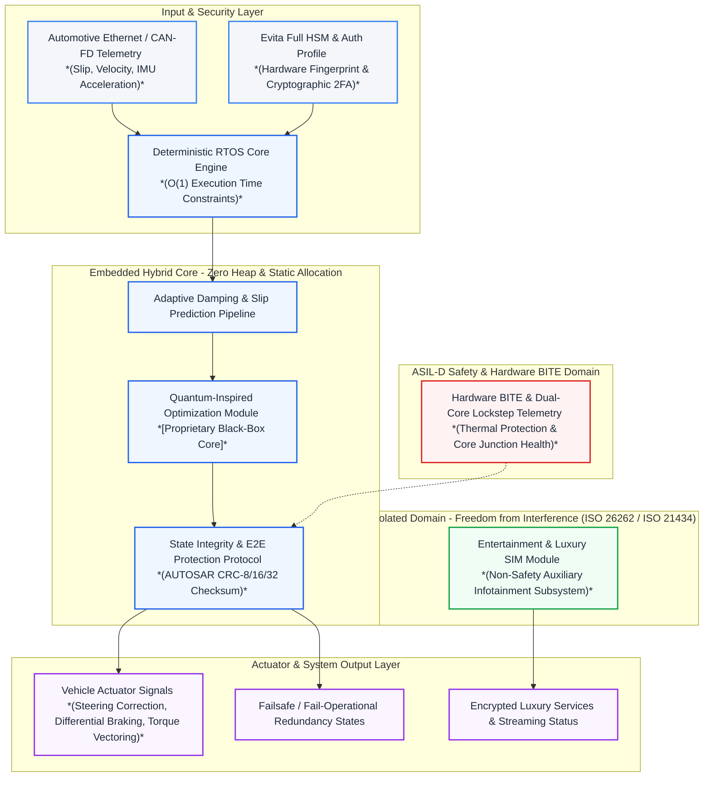

# HYBRID ADAPTIVE EMBEDDED REAL-TIME CHIP CORE

Conceptual UI UX Illustration for Demo Purposes
**SOLE INVENTOR & OWNER:** MOHAMED TALAL KADRI  
**COPYRIGHT NOTICE:** (C) 2026 MOHAMED TALAL KADRI. ALL RIGHTS RESERVED.  
**REPOSITORY STATUS:** PRIVATE / CLOSED-SOURCE  

---

## Overview

Welcome to the official repository of the **Hybrid Adaptive Embedded Real-Time Chip Core**. This project introduces a paradigm-shifting, proprietary architectural framework engineered for next-generation electric and software-defined vehicles (SDVs). By uniting ultra-low-latency deterministic execution with advanced predictive threat mitigation, this core redefines the boundaries of high-reliability embedded systems.

## Core Architecture & Principles

* **Zero-Heap Determinism:** Built completely on a static memory allocation model to completely eliminate memory fragmentation, unpredictable garbage collection, and runtime leaks.
* **Constant-Time Security:** Features hardware-grade cryptographic and authentication routines designed to resist sophisticated timing and side-channel attacks.
* **Real-Time Dynamic Adaptation:** Implements an advanced mathematical damping and predictive slip framework capable of processing high-frequency data streams within strict microsecond tolerances.
* **Seamless OTA Integration:** Supports secure, validated over-the-air synchronization paradigms designed to integrate smoothly without compromising core determinism.

## Economic Value & Commercial Incentive Model

In the modern automotive landscape, reconciling strict functional safety mandates (such as ASIL-D and ISO 26262 compliance) with high-margin recurring digital revenue has long been a complex industrial dilemma. This architecture introduces a disruptive commercial mechanism: a secure, isolated bridge that allows automotive manufacturers (OEMs) to continuously deploy next-generation connected services, personalized features, and modular over-the-air updates. By harmonizing rigorous compliance with scalable digital monetization, manufacturers can unlock lucrative, long-term recurring revenue streams (SaaS) and elevated brand equity—all while maintaining an absolute, uncompromised baseline of vehicular safety and regulatory adherence.

---

## Legal Warning & Intellectual Property Notice

> **STRICTLY PROHIBITED:** Unauthorized copying, distribution, reverse engineering, hardware synthesis, simulation, or extraction of any logic, dynamic adaptive damping algorithms, cryptographic layers, or predictive threat frameworks contained within this repository is **STRICTLY PROHIBITED** under international patent laws and global intellectual property safety regulations. 
> 
> All rights, titles, and interests in and to this technology are owned exclusively and entirely by the sole inventor: **Mohamed Talal Kadri**. 

---

## Access and Inquiries

This repository is strictly **private, closed-source, and restricted** for internal verification, compliance auditing, and authorized security reviews only. 

For official inquiries, partnership proposals, or authorized security reviews, please contact the sole owner directly via the active professional email:  
**kadritalal84@gmail.com**
